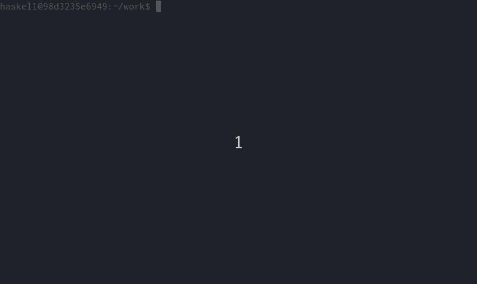

[](https://travis-ci.org/BoeingX/docker-haskell-vim)

# What is this?

`haskell-vim` is a docker-based Haskell development environment with Vim 8.x. 
It comes with syntax highlighting and code completion
powered by [Haskell IDE Engine](https://github.com/haskell/haskell-ide-engine)).

# Why?

Vim is a highly configurable, light-weight editor extremely suitable for programming in Haskell. 
Compare to heavy IDEs like Eclipse,
one does not need to create a project etc. before writing any code.
Since the release of version 8.0, it ships an embedded terminal emulator.

Haskell IDE Engine is an excellent [Language Server Protocol](https://github.com/Microsoft/language-server-protocol/blob/master/protocol.md)
client **compatible** with GHC 8.4.3.

However, it is sometimes tricky to get it work with Vim because of the
[deoplete.nvim](https://github.com/Shougo/deoplete.nvim) plugin.
Indeed, this plugin requires Vim to be built with `python3` support
which is not always the case.
> For example, on my Arch Linux machine, `gvim` is built with `python3/dyn` so I failed to get `deoplete` to work :(

With `haskell-vim`, everything just works out of box: syntax highlighting, code completion etc, 
and one can thus concentrate on learning and developing in Haskell.

# How to launch?

## Build from source

```bash
cd docker && docker build -t haskell-vim .
```

Please note that a fresh build will take a LONG time (50+ minutes on my laptop)
and consumes many RAM, so be patient :)

## Pull from docker hub (recommended)
Run

```bash
docker run -it --rm -v <local/path/to/workdir/>:/workspace boeingx/haskell-vim bash
```

> The above command maps a local folder `<local/path/to/workdir/>` to the default work directory `/home/haskell/workspace` in order to have persistent data.

# Screenshots

## Code completion


## Terminal emulator



# Troubleshooting

## When build docker image, I get an error saying Process exited with code: ExitFailure (-9) (THIS MAY INDICATE OUT OF MEMORY)

As the error message indicates, this is due to an out of memory.
Verify that you have at least 4Gb RAM available.

If you use docker on Windows or Mac OS, edit the preference so that docker could use more memory.
See [this discussion](https://github.com/commercialhaskell/stack/issues/3963)
